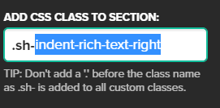
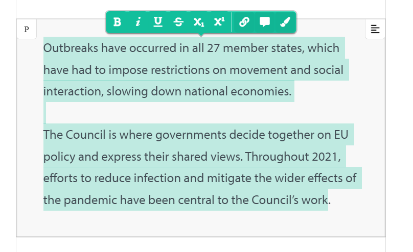

# Custom Shorthand Functionality

A Collection of JS, CSS & HTML Snippets to be imported or copied into SH stories that will enable additional features or formatting.

## Overview

The snippets in this repository are organised into directories for each function. I.e. Each directory will contain the necessary code to enable a specific feature.

In some cases, this will be only CSS or only JavaScript. In others, activating the feature will require multiple files.

Unless stated otherwise, all of these code snippets can either be used (on any SH story) by pasting the:

- JS snippets in between the `<script>` tags in the Add JS panel
- CSS snippets anywhere in the Add CSS panel

Or, alternatively, the code can be pulled directly from this repository by:

- Adding a `<link>` tag to the Custom Header field to import CSS. E.g.

```
<link rel="stylesheet" type="text/css" href="https://harpoonproductions.github.io/shorthand_utilities/auto_indent/indent.css" />
```

- Adding `<script>` tags to the Add JS panel to import JS. E.g.

```
<script type="text/javascript" src="https://harpoonproductions.github.io/shorthand_utilities/auto_indent/indent.js"></script>
```

This method will be marginally less performant than pasting the snippets in directly (as the stories will need to make an API call to grab the code on load). However, the snippets are very small so this should still be relatively fast, and it will also allow the same code to be used across multiple stories without having to copy and paste between each one.

This means that there will be a single source of truth for these snippets, which will allow them to be altered from a single location in order to update the functionality for all consuming stories.

<hr>

# Included Snippets

The following snippets are available in this repository. For instructions on each one, hit `ctrl + f` or `command + f` and search for the name of that snippet, further down this README page:

- Toggle Sections Button
- Fifth Gallery Column
- Auto Blockquote Indent
- Custom Blockquote or Rich Text Indent
- Alternating Image/Text Blocks
- Video On Scroll
- Pan Landscape Images on Mobile

<hr>

## Toggle Sections Button

This snippet will allow you to generate two buttons which toggle the visibility of the two subsequent sections.

### How to use

If this functionality is to be used as it is, you'll need to recreate the same structure as in this image:


I.e. Create an HTML Section with two buttons, with the classes of reveal-button16 & reveal-button17 respectively, then create two sections after this HTML Section that you wish to have shown or hidden on click.

[Demo](https://preview.shorthand.com/dVU9WYCd65t3S1ZA#section-1txdLBuGLP)

### How to use

To use this functionality, you will need to paste this `<link>` tag into the Custom Head field:

```
<link rel="stylesheet" type="text/css" href="https://harpoonproductions.github.io/shorthand_utilities/auto_indent/indent.css" />
```

And this `<script>` tag into the Custom JS field:

```
<script type="text/javascript" src="https://harpoonproductions.github.io/shorthand_utilities/toggle_sections_button/toggle.js"></script>
```

If you would like to extend this functionality, then you will need to modify the existing code and paste that modified code into the Add JS panel instead.

If you are to do so, you will need to edit this line in the code:

`var buttons = document.querySelectorAll(".reveal-button16, .reveal-button17");`

Doing so will allow you to add multiple button classes, separated by a comma, and those buttons will toggle the visibility of sequential sections.

For example, in that demo, there are 2 buttons in the HTML section, which means that the first button in that list will toggle the section after it, and the second button will toggle the section after that.

If you were to add a third button, and give it the class `reveal-button18`, then it would toggle the visibility of the section after those two.

You'd just need to update that line to look like this:

`var buttons = document.querySelectorAll(".reveal-button16, .reveal-button17, .reveal-button18");`

<hr>

## Fifth Gallery Column

The Fifth Gallery Column will allow you to add an additional column to the Gallery Section type

# How to use

To use this functionality, you will need to paste this `<script>` tag into the Custom JS field:

```
<script type="text/javascript" src="https://harpoonproductions.github.io/shorthand_utilities/add_fifth_gallery_column/gallery.js"></script>
```

<hr>

## Auto Blockquote Indent

The custom indent will allow you to have a column of text wrap around a `blockquote`, which will be indented to the side (rather than centralised).

### How to use

To use this functionality, you will need to paste this `<link>` tag into the Custom Head field:

```
<link rel="stylesheet" type="text/css" href="https://harpoonproductions.github.io/shorthand_utilities/auto_indent/indent.css" />
```

And this `<script>` tag into the Custom JS field:

```
<script type="text/javascript" src="https://harpoonproductions.github.io/shorthand_utilities/auto_indent/indent.js"></script>
```

<hr>

## Custom Blockquote or Rich Text Indent

This snippet can be used to indent rich text embeds or blockquotes to either the left or right of any given section.

### How to use

To use this functionality, you will need to paste this `<link>` tag into the Custom Head field:

```
<link rel="stylesheet" type="text/css" href="https://harpoonproductions.github.io/shorthand_utilities/custom_blockquote_indent/indent.css" />
```

then add one of the following classes into the Custom Class field of the section which contains your blockquote or rich text embed:

indent-rich-text-right
indent-rich-text-left
indent-blockquote-right
indent-blockquote-left

E.g.



After doing so, the Rich Text or Blockquote should responsively reposition itself at each Shorthand text breakpoint.

Please also bear in mind that this text wrap effect will be more pronounced if there is more text in the subsequent paragraph to wrap around the indented graphic or quote.

As such, to ensure that there is enough text for the effect, it might be worth placing multiple paragraphs (beneath the indented graphic) inside a single Shorthand paragraph block.

E.g.:



If you hold down shift before hitting enter, to create a new paragraph, then one will be created in the same paragraph block.

Finally, please note that these indents will only be visible in preview/published stories (the changes will not be visible in the editor). This functionality has been set intentionally, as having the effect apply in the editor seemed to inadvertently break some of the Shorthand editing functionality.

<hr>

## Alternating Image/Text Blocks

This snippet will allow you to add multiple diagonally overlapped text/image rows into a single Text Section.

[Demo](https://preview.shorthand.com/1inJn0oUVq4ynQpN)

### How to use

To use this functionality, you will need to paste this `<link>` tag into the Custom Head field:

```
<link rel="stylesheet" type="text/css" href="https://harpoonproductions.github.io/shorthand_utilities/alternating_image_text/alternate.css" />
```

And this `<script>` tag into the Custom JS field:

```
<script type="text/javascript" src="https://harpoonproductions.github.io/shorthand_utilities/alternating_image_text/alternate.js"></script>
```

You'll then need to create a new Text Section, for each collection of image & text pairs, and add `timeline` into their Custom Class fields.

Then, within each section, you can add multiple pairs of consecutive Inline HTML and Inline Image blocks. Each pair of blocks will be combined by the JS script, which will apply its own background and formatting, relative to the previous block.

NOTE: You should delete any remaining, empty paragraph blocks in these Text Sections before previewing the story.

<hr>

## Video On Scroll

This code will allow you to add a video to your story that can be will play on scroll (i.e. You can increment or reverse the video clip by scrolling down or up the page). Additionally, Custom Text Boxes can be added to these videos and you will be able to set at which second they appear on screen:

[Demo1](https://preview.shorthand.com/uOQOcChcZ7RxOdZ5)
[Demo2](https://preview.shorthand.com/WE6pkOImvdGdz5KA)
[Demo3](https://preview.shorthand.com/0jsa8CWExoTljFYl)

### How to use

To use this functionality, you will need to paste this `<link>` tag into the Custom Head field:

```
<link rel="stylesheet" type="text/css" href="https://harpoonproductions.github.io/shorthand_utilities/video_on_scroll/scroll.css" />
```

And this `<script>` tag into the Custom JS field:

```
<script type="text/javascript" src="https://harpoonproductions.github.io/shorthand_utilities/video_on_scroll/scroll.js"></script>
```

You'll then need to add 'video-section' to the custom class field of the Custom HTML Section into which you're pasting the video snippet.

Then, any text blocks in the video HTML can be time stamped to any second of your video clip by just adding 'time-X' to the end of the classes of that element.

E.g. (for the Demo 1 video):

<div class="navigation-video-container">
   <video id="video" autoplay playinline muted src="https://harpn.s3.eu-west-2.amazonaws.com/video/car_encoded_960.mp4">
   </video>

   <div class="text-block block-1 time-1">
      Drive
   </div>

   <div class="text-block block-2 time-4">
      Free
   </div>
</div>

The 'time-1' class ensures the first block is visible at 1 second, and the 'time-4' class will mean that the second block is visible at 4 seconds.

As an example, this feature was used in the Demo 3 video, so that the appropriate text would appear whenever that piece of lab equipment was visible on screen.

Note:

These videos needed to be encoded to work with a new memory saving function of this new JavaScript snippet (which is used to ensure smooth video scrolling and full mobile compatibility).

This is simple enough to do with a program called FFmpeg.

If you install [this program](https://www.ffmpeg.org/download.html) on your computer, then you can run the command below, from any terminal, to convert an mp4 into a properly encoded video file:

ffmpeg -i C:\Users\Alex\Downloads\lab_equipment.mp4 -vf scale=960:-1 -movflags faststart -vcodec libx264 -crf 20 -g 1 -pix_fmt yuv420p C:\Users\Alex\Downloads\lab_equipment_encoded_960.mp4

You'll just need to replace the source and destination video files in that line with the ones on your laptop.

<hr>

## Pan Landscape Images on Mobile

This code will allow you to convert any standard Text Over Media section into a panning image (on mobile).

As the panning effect is only present on mobile (or smaller screen widths), you will need to reduce the width of the viewing window to see the effect if you are checking this story on your desktop:

[Demo](https://preview.shorthand.com/kWtsJpAVXwfSFaMZ)

### How to use

To use this functionality, you will need to paste this `<link>` tag into the Custom Head field:

```
<link rel="stylesheet" type="text/css" href="https://harpoonproductions.github.io/shorthand_utilities/mobile_pan/pan.css" />
```

And this `<script>` tag into the Custom JS field:

```
<script type="text/javascript" src="https://harpoonproductions.github.io/shorthand_utilities/mobile_pan/pan.js"></script>
```

This solution utilises a clone of the default Shorthand image upload.

As such, you will not need to add any custom html to the page or reference any file from your Amazon S3 directory (just upload an image to the TOM Section as normal).

The effect is then activated by adding this class to the Custom Class field:

`pan-mobile`

In addition, you will also be able to change the direction of this image panning by adding this custom class instead:

`pan-mobile-right`
