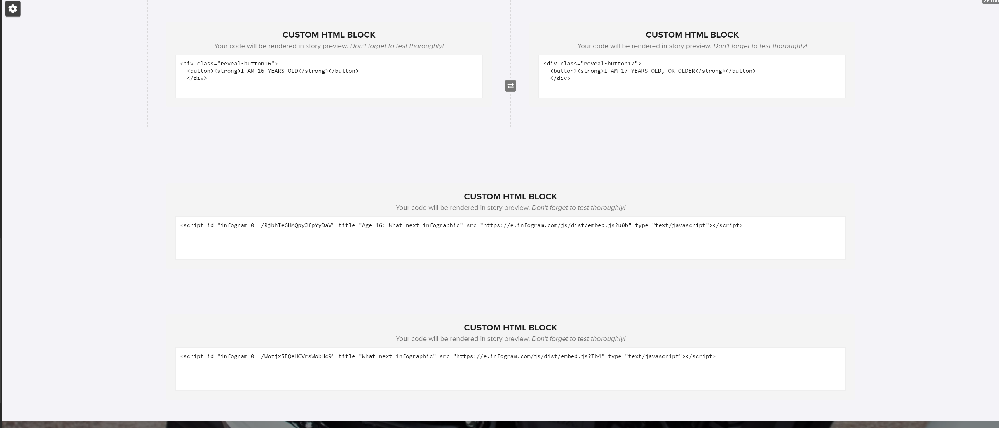

# Custom Shorthand Functionality

A Collection of JS, CSS & HTML Snippets to be imported or copied into SH stories that will enable additional features or formatting.

## Overview

The snippets in this repository are organised into directories for each function. I.e. Each directory will contain the necessary code to enable a specific feature.

In some cases, this will be only CSS or only JavaScript. In others, activating the feature will require multiple files.

Unless stated otherwise, all of these code snippets can be used on any SH story by pasting:

- JS snippets in between the `<script>` tags in the Add JS panel
- CSS snippets anywhere in the Add CSS panel
- HTML snippets inline into an HTML Block or Section

Alternatively, the code can be pulled directly from this repository by:

- Adding a `<link>` tag to the Custom Header field to import CSS. E.g.

```
<link rel="stylesheet" type="text/css" href="https://harpoonproductions.github.io/shorthand_utilities/additional_indent/indent.css" />
```

- Adding `<script>` tags to the Add JS panel to import JS. E.g.

```
<script type="text/javascript" src="https://harpoonproductions.github.io/shorthand_utilities/additional_indent/indent.js"></script>
```

This method will be marginally less performant than pasting the snippets in directly (as the stories will need to make an API call to grab the code on load). However, it will also allow the same code to be used across multiple stories without having to copy and paste between each one.

This method also provides a single source of truth for these snippets, which will allow them to be altered from a single location in order to update the functionality for all consuming stories.

<hr>

# Included Snippets

The following snippets are available in this repository. For instructions on each one, hit `ctrl + f` or `command + f` and search for the name of that snippet, further down this README page:

- Custom Indent
- Toggle Sections Button
- Add Fifth Gallery Column

<hr>

## Custom Indent

The custom indent will allow you to have a column of text wrap around a `blockquote`, which will be indented to the side (rather than centralised).

### How to use

To use this functionality, you will need to paste this `<link>` tag into the Custom Head field:

```
<link rel="stylesheet" type="text/css" href="https://harpoonproductions.github.io/shorthand_utilities/additional_indent/indent.css" />
```

And this `<script>` tag into the Custom JS field:

```
<script type="text/javascript" src="https://harpoonproductions.github.io/shorthand_utilities/additional_indent/indent.js"></script>
```

<hr>

## Toggle Sections Button

This snippet will allow you to generate two buttons which toggle the content of two subsequent HTML blocks.

### How to use

If this functionality is to be used as it is, you'll need to recreate the same structure as in this image:



This will generate two buttons which can be clicked to show and hide the content of the two subsequent HTML blocks.

[Example](https://preview.shorthand.com/dVU9WYCd65t3S1ZA#section-1txdLBuGLP)

### How to use

To use this functionality, you will need to paste this `<link>` tag into the Custom Head field:

```
<link rel="stylesheet" type="text/css" href="https://harpoonproductions.github.io/shorthand_utilities/additional_indent/indent.css" />
```

And this `<script>` tag into the Custom JS field:

```
<script type="text/javascript" src="https://harpoonproductions.github.io/shorthand_utilities/toggle_sections_button/toggle.js"></script>
```

<hr>

## Fifth Gallery Column

The Fifth Gallery Column will allow you to add an additional column to the Gallery Section type

# How to use

To use this functionality, you will need to paste this `<script>` tag into the Custom JS field:

```
<script type="text/javascript" src="https://harpoonproductions.github.io/shorthand_utilities/add_fifth_gallery_column/gallery.js"></script>
```
